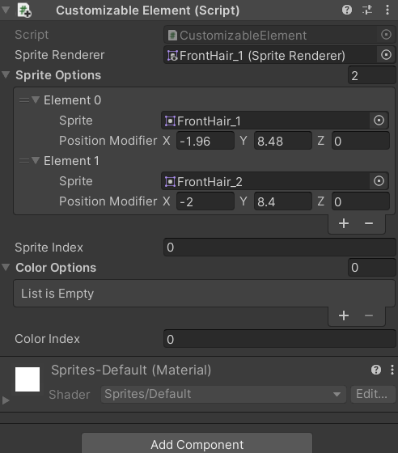
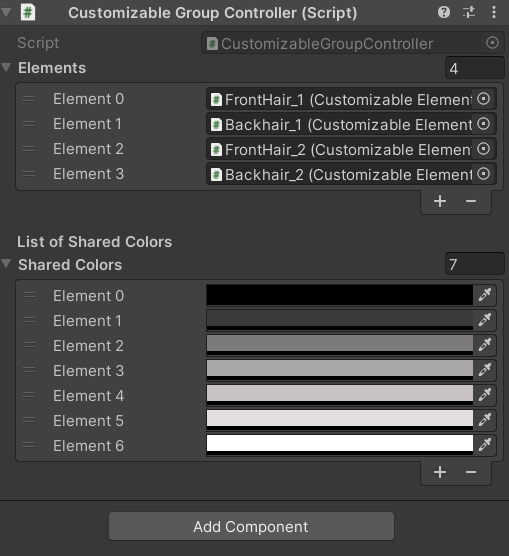
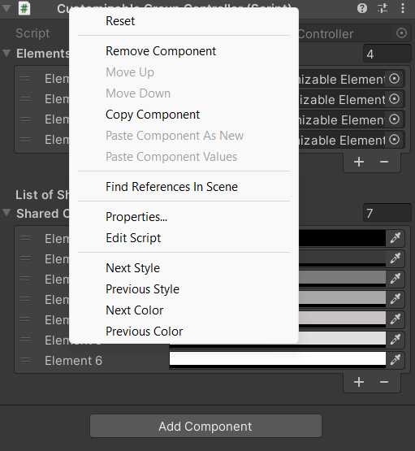
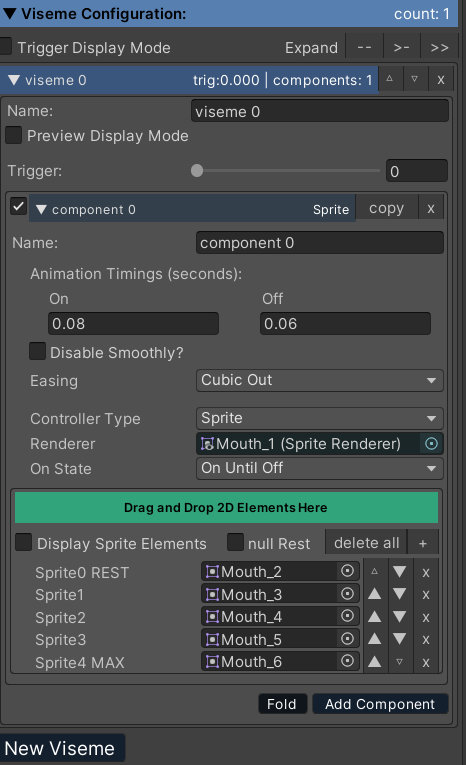

# 🎮 Unity Character Customization & LipSync (SALSA) System

Dokumentasi ini menjelaskan cara implementasi fitur **Character Customization** dan integrasi dengan **SALSA LipSync** pada proyek Unity.

---

## ✨ Fitur yang Tersedia

- Kustomisasi karakter secara visual:
  - Pergantian **sprite** (misal: rambut, pakaian, aksesoris)
  - Pergantian **warna** tiap elemen
- Sistem grup untuk mengatur beberapa elemen sekaligus
- Integrasi **LipSync otomatis** menggunakan plugin SALSA

---

## 🧩 Struktur Script

### 1. `CustomizableElement.cs`
Script ini digunakan untuk elemen yang bisa dikustomisasi secara individual (sprite dan warna).

**Properti Utama:**
- `SpriteOptions`: Daftar sprite alternatif
- `ColorOptions`: Daftar warna yang bisa dipilih
- `SpriteIndex` dan `ColorIndex`: Indeks untuk navigasi data
- `UpdateSprite()` dan `UpdateColor()`: Metode untuk menerapkan perubahan

---

### 2. `CustomizableGroupController.cs`
Script ini digunakan untuk mengelompokkan beberapa `CustomizableElement` agar bisa diganti bersamaan.

**Fitur:**
- `NextStyle()` / `PreviousStyle()`: Mengganti sprite pada semua elemen
- `NextColor()` / `PreviousColor()`: Mengubah warna bersama

---

## 🧱 Cara Penggunaan

### 1. Menambahkan Sprite Baru untuk Customization

#### 📁 Langkah-langkah:
1. Pilih GameObject (contoh: rambut, pakaian) → Tambahkan script `CustomizableElement`.
2. Isi kolom:
   - `Sprite Renderer`: Masukkan komponen SpriteRenderer dari objek tersebut.
   - `Sprite Options`: Tambahkan sprite alternatif dalam list ini.
3. Klik kanan pada komponen `CustomizableElement` → Pilih `Next Sprite` / `Previous Sprite` untuk menguji.

4. Buat GameObject baru → Tambahkan script `CustomizableGroupController`.
5. Tambahkan semua elemen ke list **Elements**.
6. Gunakan `Next Style()` / `Previous Style()` untuk mengganti sprite semua elemen sekaligus.

#### 🧠 Catatan:
- `PositionedSprite` dapat menyesuaikan posisi tiap sprite berbeda (opsional).
- Pastikan jumlah sprite > 1 agar fitur dapat terlihat.

---

### 2. Menambahkan Warna Baru ke Daftar Warna

#### 📁 Langkah-langkah:
1. Tambahkan script `CustomizableElement` ke objek yang ingin diubah warnanya.
2. Isi `Sprite Renderer` dan `Color Options` (tambahkan warna-warna pilihan).
3. Klik kanan → `Next Color` / `Previous Color` untuk uji perubahan.

4. Untuk grup:
   - Tambahkan script `CustomizableGroupController` ke objek kontrol.
   - Tambahkan elemen `CustomizableElement` ke list `Elements`.
   - Isi `Shared Colors` dengan daftar warna yang diinginkan.

#### 🧠 Tips:
- Pastikan alpha warna tidak 0 (transparan).
- Cocok untuk objek seperti pakaian, mata, kulit, dll.

---

### 3. Integrasi LipSync Menggunakan SALSA

#### 📁 Langkah-langkah:
1. Import plugin **SALSA LipSync** dari Asset Store ke proyek.
2. Buat GameObject untuk kepala/karakter.
3. Tambahkan komponen `SALSA` ke objek tersebut.
4. Tambahkan komponen `AudioSource` dan input audio file (VO).
5. Siapkan sprite viseme (mulut) untuk tiap suara: A, E, U, O, L, dll.
6. Di SALSA, hubungkan sprite viseme ke masing-masing ekspresi.

#### 🧠 Tips:
- Gunakan `SpriteRenderer` yang berbeda untuk mulut.
- Pastikan SALSA terhubung ke sumber audio (mic atau file).
- Cek dokumentasi resmi SALSA untuk pengaturan lanjutan.

---